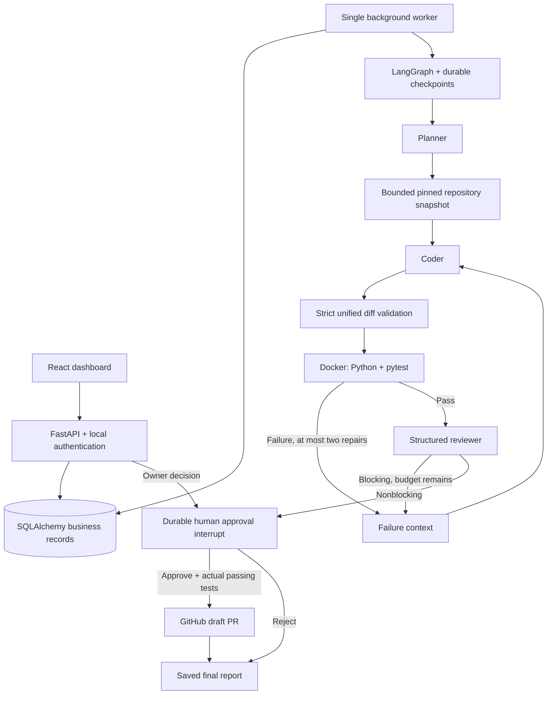

# Architecture

SQLite business storage and checkpoints provide a simple local demo. Docker Compose supplies PostgreSQL for both business records and LangGraph checkpoints. Graph transitions run outside HTTP requests. One worker is supported: on restart it requeues interrupted running jobs and resumes the recorded checkpoint. Do not scale the worker service without adding leases and fencing.

The repository analyst deterministically retrieves and lists a bounded Python snapshot rather than asking a model to choose arbitrary tools. The planner, coder and reviewer use schema-validated outputs from an OpenAI-compatible JSON chat endpoint in live mode. Provider adapters are isolated in `providers.py`.

MVP constraints: 1–60 visible Python files, 20KB per file, 500KB total source, 10 changed files, 100KB patch, existing-file modifications and new Python files, pytest with no additional third-party dependencies. No renames, deletes, binary changes, symlinks, hidden files, package installation, arbitrary commands or language autodetection. Repositories needing additional packages require an administrator-built sandbox image.

Live setup stores operator credentials in a Fernet-encrypted local vault. API and worker load current settings on each integration call. Readiness verifies a real structured model response and GitHub identity, then checks the Docker runtime/image. The worker holds provider credentials and Docker orchestration authority. Models have no executable tools. Untrusted source code only executes in a disposable container; a non-running staging container receives the bounded source archive and is committed to a temporary local image. The actual test container copies `/seed` into a bounded tmpfs, with non-root UID, no network, no capabilities, a read-only root filesystem, CPU/memory/PID/output/time limits and no host mount or socket. The model receives a bounded, redacted prompt.

Local account authentication uses salted PBKDF2 hashes and 24-hour HMAC-signed HttpOnly SameSite=Strict cookies. Database ownership checks cover every repository, run, artifact and decision. Configure TLS and secure cookies before exposing it beyond localhost. The development GitHub token is an administrator credential, suitable for a private single-operator workspace. Per-user GitHub App installations/OAuth and production identity are future work.

Reference APIs: [LangGraph interrupts](https://reference.langchain.com/python/langgraph/types/interrupt), [SQLite checkpoints](https://reference.langchain.com/python/langgraph.checkpoint.sqlite), [GitHub trees](https://docs.github.com/en/rest/git/trees), [draft pull requests](https://docs.github.com/en/rest/pulls/pulls).
